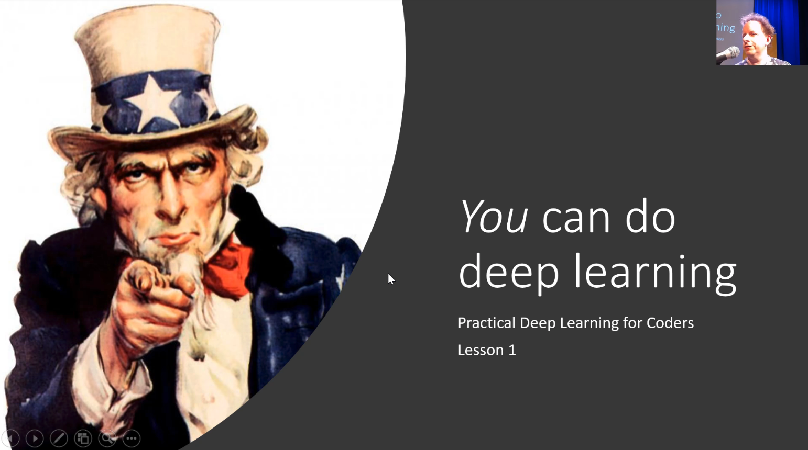
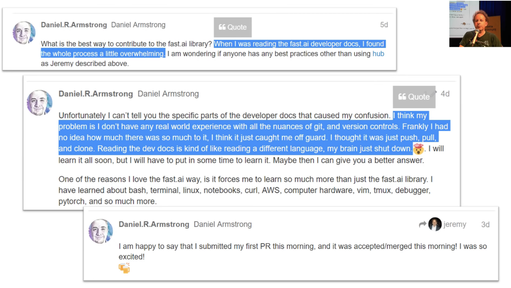
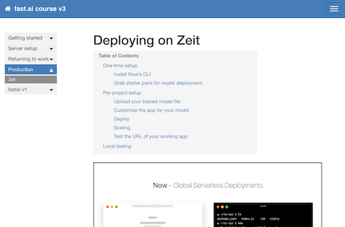
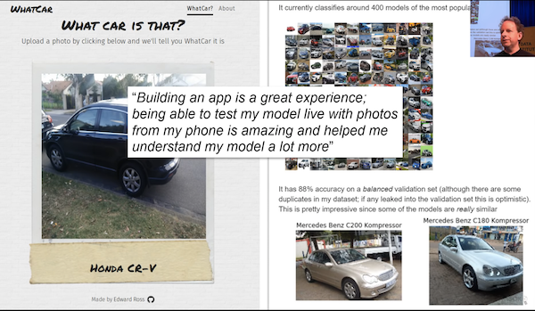
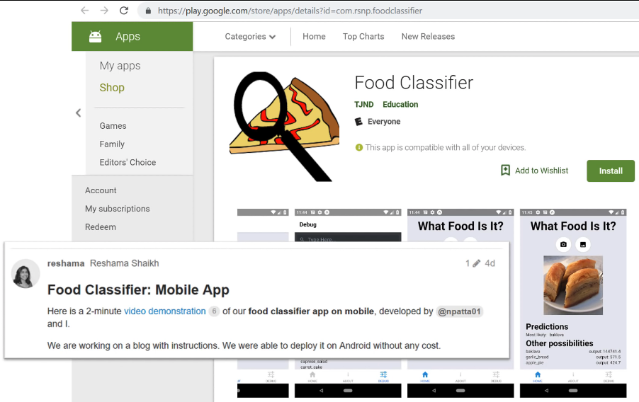

# Lesson 1 introduction

[[2:45](https://youtu.be/BWWm4AzsdLk?t=165)] 

Jupyter Notebook is a really interesting device for data scientists because it lets you run interactive experiments and give you not just a static piece of information but something you can interactively experiment with.

How to use notebooks and the materials well based on the last three years of experience:

1. Just watch a lesson end to end. 
   - Don't try to follow along because it's not really designed to go the speed where you can follow along. It's designed to be something where you just take in the information, you get a general sense of all the pieces, how it all fits together.
   - Then you can go back and go through it more slowly pausing the video, trying things out, making sure that you can do the things that I'm doing and you can try and extend them to do things in your own way.
   - Don't try and stop and understand everything the first time. 

### You can do world-class practitioner level deep learning [[4:31](https://youtu.be/BWWm4AzsdLk?t=271)]

Main places to be looking for things are:
- [http://course-v3.fast.ai/](http://course-v3.fast.ai/)
- [https://forums.fast.ai/](https://forums.fast.ai/latest)

### A little bit about why we should listen to Jeremy [[5:27](https://youtu.be/BWWm4AzsdLk?t=327)]

### Using machine learning to do useful things [[6:48](https://youtu.be/BWWm4AzsdLk?t=408)]

[[7:26](https://youtu.be/BWWm4AzsdLk?t=446)]

If you follow along with 10 hours a week or so approach for the 7 weeks, by the end, you will be able to:

1. Build an image classification model on pictures that you choose that will work at a world class level
2. Classify text using whatever datasets you're interested in
3. Make predictions of commercial applications like sales
4. Build recommendation systems such as the one used by Netflix

Not toy examples of any of these but actually things that can come top 10 in Kaggle competitions, that can beat everything that's in the academic community. 

The prerequisite is one year of coding and high school math.

### What people say about deep learning which are either pointless or untrue [[9:05](https://youtu.be/BWWm4AzsdLk?t=545)]

- It's not a black box. It's really great for interpreting what's going on.
- It does not need much data for most practical applications.
- You don't need a PhD. Rachel has one so it doesn't actually stop you from doing deep learning if you have a PhD.
- It can be used very widely for lots of different applications, not just for vision.
- You don't need lots of hardware. 36 cents an hour server is more than enough to get world-class results for most problems.
- It is true that maybe this is not going to help you build a sentient brain, but that's not our focus. We are focused on solving interesting real-world problems.

[[10:24](https://youtu.be/BWWm4AzsdLk?t=624)]

Baseball vs. Cricket - An example by Nikhil of what you are going to be able to do by the end of lesson 1:

### Topdown approach [[11:02](https://youtu.be/BWWm4AzsdLk?t=662)]

We are going to start by looking at code which is different to many of academic courses. We are going to learn to build a useful thing today. That means that at the end of today, you won't know all the theory. There will be lots of aspects of what we do that you don't know why or how it works. That's okay! You will learn why and how it works over the next 7 weeks. But for now, we've found that what works really well is to actually get your hands dirty coding - not focusing on theory. 

# Lesson 2 introduction

### Forum tips and tricks [[0:17]](https://youtu.be/Egp4Zajhzog?t=17)

Two important forum topics:

- [FAQ, resources, and official course updates](https://forums.fast.ai/t/faq-resources-and-official-course-updates/27934/)

- [Lesson 2 official resources and updates](https://forums.fast.ai/t/lesson-2-official-resources-and-updates/28630)

#### "Summarize This Topic" [[2:32]](https://youtu.be/Egp4Zajhzog?t=152)

After just one week, the most popular thread has 1.1k replies which is intimidatingly large number. You shouldn't need to read all of it.  What you should do is click "Summarize This Topic" and it will only show the most liked ones.

####  Returning to work [[3:19]](https://youtu.be/Egp4Zajhzog?t=199)

https://course-v3.fast.ai/ now has a "Returning to work" section which will show you (for each specific platform you use):

- How to make sure you have the latest notebooks
- How to make sure you have the latest fastai library 

If things aren't working for you, if you get into some kind of messy situation, which we all do, just delete your instance and start again unless you've got mission-critical stuff there — it's the easiest way just to get out of a sticky situation.

### What people have been doing this week [[4:19]](https://youtu.be/Egp4Zajhzog?t=259)

[Share your work here](https://forums.fast.ai/t/share-your-work-here/27676/) 

- [Figuring out who is talking — is it Ben Affleck or Joe Rogan](https://forums.fast.ai/t/share-your-work-here/27676/143) 
- [Cleaning up Watsapp downloaded images folder to get rid of memes](https://forums.fast.ai/t/share-your-work-here/27676/97)

[Forum post](https://forums.fast.ai/t/share-your-work-here/27676/215)

One of the really interesting projects was looking at the sound data that was used in [this paper](https://arxiv.org/abs/1608.04363). In this paper, they were trying to figure out what kind of sound things were. They got a state of the art of nearly 80% accuracy. Ethan Sutin then tried using the lesson 1 techniques and got 80.5% accuracy, so I think this is pretty awesome. Best as we know, it's a new state of the art for this problem. Maybe somebody since has published something we haven't found it yet. So take all of these with a slight grain of salt, but I've mentioned them on Twitter and lots of people on Twitter follow me, so if anybody knew that there was a much better approach, I'm sure somebody would have said so.

[[6:01](https://youtu.be/Egp4Zajhzog?t=361)]

[Forum post](https://forums.fast.ai/t/share-your-work-here/27676/38)

Suvash has a new state of the art accuracy for Devanagari text recognition. I think he's got it even higher than this now. This is actually confirmed by the person on Twitter who created the dataset. I don't think he had any idea, he just posted here's a nice thing I did and this guy on Twitter said: "Oh, I made that dataset. Congratulations, you've got a new record." So that was pretty cool.

[[6:28](https://youtu.be/Egp4Zajhzog?t=388)]

[The Mystery of the Origin](https://medium.com/@alenaharley/the-mystery-of-the-origin-cancer-type-classification-using-fast-ai-libray-212eaf8d3f4e)

I really like this post from Alena Harley. She describes in quite a bit of detail about the issue of metastasizing cancers and the use of point mutations and why that's a challenging important problem. She's got some nice pictures describing what she wants to do with this and how she can go about turning this into pictures. This is the cool trick — it's the same with urning sounds into pictures and then using the lesson 1 approach. Here is turning point mutations into pictures and then using the lesson 1 approach. And it seems that she's got a new state of the art result by more than 30% beating the previous best. Somebody on Twitter who is a VP at a genomics analysis company looked at this as well and thought it looked to be a state of the art in this particular point mutation one as well. So that's pretty exciting. 

When we talked about last week this idea that this simple process is something which can take you a long way, it really can. I will mention that something like this one in particular is using a lot of domain expertise, like figuring out that picture to create. I wouldn't know how to do that because I don't really know what a point mutation is, let alone how to create something that visually is meaningful that a CNN could recognize. But the actual deep learning side is actually straight forward.

[[8:07](https://youtu.be/Egp4Zajhzog?t=487)]

Another cool result from Simon Willison and Natalie Downe, they created a cougar or not web application over the weekend and won the Science Hack Day award in San Francisco. So I think that's pretty fantastic. So lots of examples of people doing really interesting work. Hopefully this will be inspiring to you to think well to think wow, this is cool that I can do this with what I've learned. It can also be intimidating to think like wow, these people are doing amazing things. But it's important to realize that as thousands of people are doing this course, I'm just picking out a few of really amazing ones. And in fact Simon is one of these very annoying people like Christine Payne who we talked about last week who seems to be good at everything he does. He created Django which is the world's most popular web frameworks, he founded a very successful startup, etc. One of those annoying people who tends to keep being good at things, now turns out he's good at deep learning as well. So that's fine. Simon can go on and win a hackathon on his first week of playing with deep learning. Maybe it'll take you two weeks to win your first hackathon. That's okay. 

[[9:22](https://youtu.be/Egp4Zajhzog?t=562)]

I think it's important to mention this because there was this really inspiring blog post this week from James Dellinger who talked about how he created a bird classifier using techniques from lesson 1. But what I really found interesting was at the end, he said he nearly didn't start on deep learning at all because he went through the scikit-learn website which is one of the most important libraries of Python and he saw this. And he described in this post how he was just like that's not something I can do. That's not something I understand. Then this kind of realization of like oh, I can do useful things without reading the Greek, so I thought that was really cool message. 

[[10:01](https://youtu.be/Egp4Zajhzog?t=601)]

I really wanted to highlight Daniel Armstrong on the forum. I think really shows he's a great role model here. He was saying I want to contribute to the library and I looked at the docs and I just found it overwhelming. The next message, one day later, was I don't know what any of this is, I didn't know how much there is to it, caught me off guard, my brain shut down but I love the way it forces me to learn so much. And a day later, I just submitted my first pull request. So I think that's awesome. It's okay to feel intimidated. There's a lot. But just pick one piece and dig into it. Try and push a piece of code or a documentation update, or create a classifier or whatever.

[[10:49](https://youtu.be/Egp4Zajhzog?t=649)]

So here's lots of cool classifiers people have built. It's been really inspiring. 

- Trinidad and Tobago islanders versus masquerader classifier
- A zucchini versus cucumber classifier
- Dog and cat breed classifier from last week and actually doing some exploratory work to see what the main features were, and discovered that one was most hairy dog and naked cats. So there are interesting you can do with interpretation. 
- Somebody else in the forum took that and did the same thing for anime to find that they had accidentally discovered an anime hair color classifier.
- We can now detect the new versus the old Panamanian buses.
- Henri Palacci discovered that he can recognize with 85% accuracy which of 110 countries a satellite image is of which is definitely got to be beyond human performance of just about anybody. 
- Batik cloth classification with a hundred percent accuracy
- Dave Luo did this interesting one. He actually went a little bit further using some techniques we'll be discussing in the next couple of courses to build something that can recognize complete/incomplete/foundation buildings and actually plot them on aerial satellite view. 

So lots and lots of fascinating projects. So don't worry. It's only been one week. It doesn't mean everybody has to have had a project out yet. A lot of the folks who already have a project out have done a previous course, so they've got a bit of a head start. But we will see today how you can definitely create your own classifier this week. 

[[12:56]](https://youtu.be/Egp4Zajhzog?t=776)

So from today, after we did a bit deeper into really how to make these computer vision classifiers and particular work well, we're then going to look at the same thing for text. We're then going to look at the same thing for tabular data. They are more like spreadsheets and databases. Then we're going to look at collaborative filtering (i.e. recommendation systems). That's going to take us into a topic called embeddings which is a key underlying platform behind these applications. That will take us back into more computer vision and then back into more NLP. So the idea here is that it turns out that it's much better for learning if you see things multiple times so rather than being like okay, that's computer vision, you won't see it again for the rest of the course, we're actually going to come back to the two key applications NLP and computer vision a few weeks apart. That's going to force your brain to realize oh, I have to remember this. It's not must something I can throw away. 

[[14:06]](https://youtu.be/Egp4Zajhzog?t=846)

For people who have more of a hard sciences background in particular, a lot of folks find this hey, here's some code, type it in, start running it approach rather than here's lots of theory approach confusing and surprising and odd at first. So for those of you, I just wanted to remind you this basic tip which is keep going. You're not expected to remember everything yet. You're not expected to understand everything yet. You're not expected to know why everything works yet. You just want to be in a situation where you can enter the code and you can run it and you can get something happening and then you can start to experiment and you get a feel for what's going on. Then push on. Most of the people who have done the course and have gone on to be really successful watch the videos at least three times. So they kind of go through the whole lot and then go through it slowly the second time, then they go through it really slowly the third time. I consistently hear them say I get a lot more out of it each time I go through. So don't pause at lesson 1 and stop until you can continue. 

This approach is based on a lot of academic research into learning theory. One guy in particular David Perkins from Harvard has this really great analogy. He is a researcher into learning theory. He describes this approach of whole game which is basically if you're teaching a kid to play soccer, you don't first of all teach them about how the friction between a ball and grass works and then teach them how to saw a soccer ball with their bare hands, and then teach them the mathematics of parabolas when you kick something in the air. No. You say, here's a ball. Let's watch some people playing soccer. Okay, now we'll play soccer and then gradually over the following years, learn more and more so that you can get better and better at it. So this is kind of what we're trying to get you to do is to play soccer which in our case is to type code and look at the inputs and look at the outputs. 

# Lesson 3 start

A quick correction on citation. This chart originally cane from Andrew Ng's excellent machine learning course on Coursera. Apologies for the incorrect citation. 

[Andrew Ng's machine learning course](https://www.coursera.org/learn/machine-learning) on Coursera is great. In some ways, it's a little dated but a lot of the content is as appropriate as ever and taught in a bottom-up style. So it can be quite nice to combine it with our top down style and meet somewhere in the middle. 

Also, if you are interested in machine learning foundations, you should check out our [machine learning course](https://course.fast.ai/ml) as well. It is about twice as long as this deep learning course and takes you much more gradually through some of the foundational stuff around validation sets, model interpretation, how PyTorch tensor works, etc. I think all these courses together, if you really dig deeply into the material, do all of them. I know a lot of people who have and end up saying "oh, I got more out of each one by doing a whole lot". Or you can backwards and forwards to see which one works for you.

We started talking about deploying your web app last week. One thing that's going to make life a lot easier for you is that https://course-v3.fast.ai/ has a production section where right now we have one platform but more will be added showing you how to deploy your web app really easily. When I say easily, for example, here is [how to deploy on Zeit guide](https://course-v3.fast.ai/deployment_zeit.html) created by Navjot. 

As you can see, it's just a page. There's almost nothing to and it's free. It's not going to serve 10,000 simultaneous requests but it'll certainly get you started and I found it works really well. It's fast. Deploying a model doesn't have to be slow or complicated anymore. And the nice thing is, you can use this for a Minimum Viable Product (MVP) if you do find it's starting to get a thousand simultaneous requests, then you know that things are working out and you can start to upgrade your instance types or add to a more traditional big engineering approach. If you actually use this starter kit, it will create my teddy bear finder for you. So the idea is, this template is as simple as possible. So you can fill in your own style sheets, your own custom logic, and so forth. This is designed to be a minimal thing, so you can see exactly what's going on. The backend is a simple REST style interface that sends back JSON and the frontend is a super simple little Javascript thing. It should be a good way to get a sense of how to build a web app which talks to a PyTorch model. 

#### Examples of web apps people have built during the week [3:36](https://youtu.be/PW2HKkzdkKY?t=216)

Edward Ross built the what Australian car is that? app

I thought it was interesting that Edward said on the forum that building of this app was actually a great experience in terms of understanding how the model works himself better. It's interesting that he's describing trying it out on his phone. A lot of people think "oh, if I want something on my phone, I have to create some kind of mobile TensorFlow, ONNX, whatever tricky mobile app"﹣you really don't. You can run it all in the cloud and make it just a web app or use some kind of simple little GUI frontend that talks to a rest backend. It's not that often that you'll need to actually run stuff on the phone. So this is a good example of that. 

<table>
<tr>
<td>  <a href="https://forums.fast.ai/t/share-your-work-here/27676/400">Guitar Classifier</a> by Christian Werner</td><td> <a href="https://forums.fast.ai/t/share-your-work-here/27676/340">Healthy or Not!</a> by Nikhil Utane </td><td>  <a href="https://forums.fast.ai/t/share-your-work-here/27676/333">Hummingbird Classifier</a> by Nissan Dookeran</td>
</tr><tr>
<td>  <a href="https://forums.fast.ai/t/share-your-work-here/27676/409">Edible Mushroom?</a> by Ramon</td><td>  <a href="https://forums.fast.ai/t/share-your-work-here/27676/387">Cousin Recognizer</a> by Charlie Harrington</td><td>  <a href="https://forums.fast.ai/t/share-your-work-here/27676/386">Emotion Classifier</a> by Ethan Sutin and Team 26</td>
</tr><tr>
<td>  <a href="https://forums.fast.ai/t/share-your-work-here/27676/350">American Sign Language</a> by Keyur Paralkar</td><td>  <a href="https://forums.fast.ai/t/share-your-work-here/27676/355">Your City from Space</a> by Henri Palacci</td><td>  <a href="https://forums.fast.ai/t/share-your-work-here/27676/367">Univariate TS as images using Gramian Angular Field</a> by Ignacio Oguiza</td>
</tr><tr>
<td>  <a href="https://forums.fast.ai/t/share-your-work-here/27676/348">Face Expression Recognition</a> by Pierre Guillou</td><td> <a href="https://forums.fast.ai/t/share-your-work-here/27676/352">Tumor-normal sequencing</a> by Alena Harley</td><td>  </td>
</tr><table>

Nice to see what people have been building in terms of both web apps and just classifiers. What we are going to do today is look at a whole a lot more different types of model that you can build and we're going to zip through them pretty quickly and then we are going to go back and see how all these things work and what the common denominator is. All of these things, you can create web apps from these as well but you'll have to think about how to slightly change that template to make it work with these different applications. I think that'll be a really good exercise in making sure you understand the material.

# Lesson 7 start

I wanted to start by showing some cool work done by a couple of students; Reshama and Nidhin who have developed an Android and an iOS app, so check out [Reshma's post on the forum](https://forums.fast.ai/t/share-your-work-here/27676/679?u=hiromi) about that because they have a demonstration of how to create both Android and iOS apps that are actually on the Play Store and on the Apple App Store, so that's pretty cool. First ones I know of that are on the App Store's that are using fast.ai. Let me also say a huge thank you to Reshama for all of the work she does both for the fast.ai community and the machine learning community more generally, and also the [Women in Machine Learning](https://wimlworkshop.org/) community in particular. She does a lot of fantastic work including providing lots of fantastic documentation and tutorials and community organizing and so many other things. So thank you, Reshama and congrats on getting this app out there.

