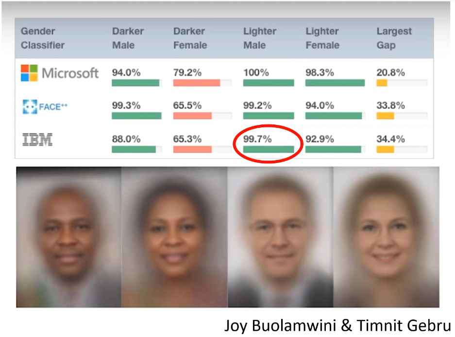
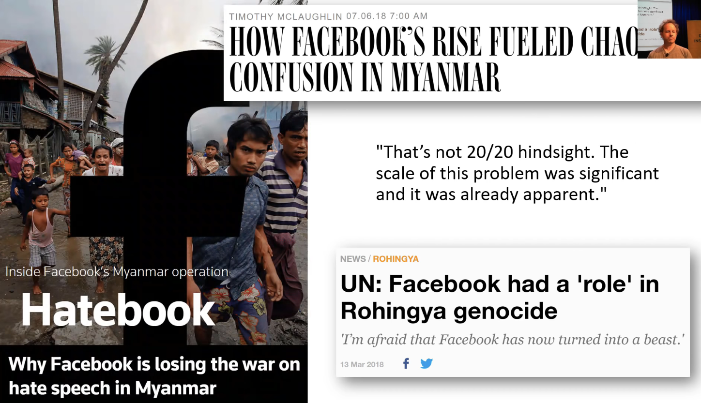
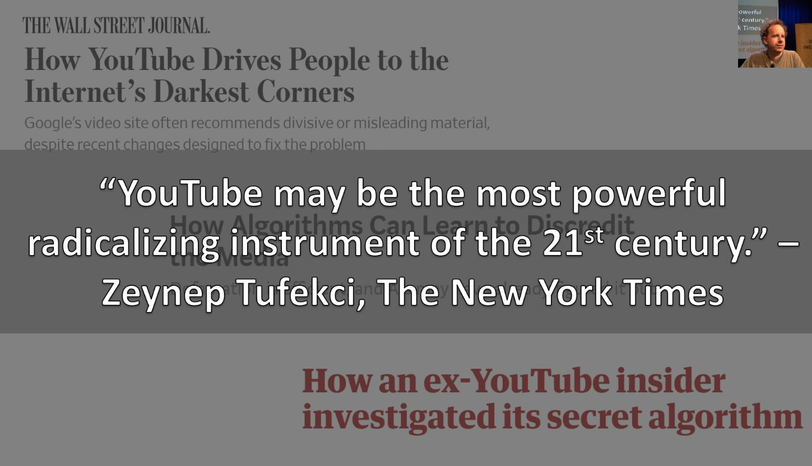
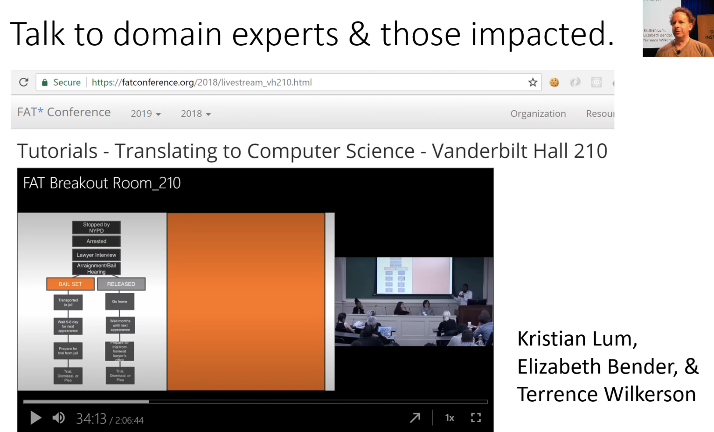
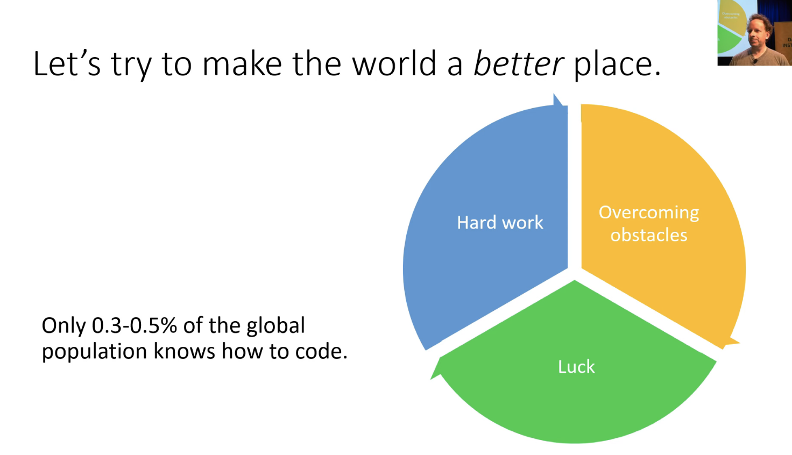
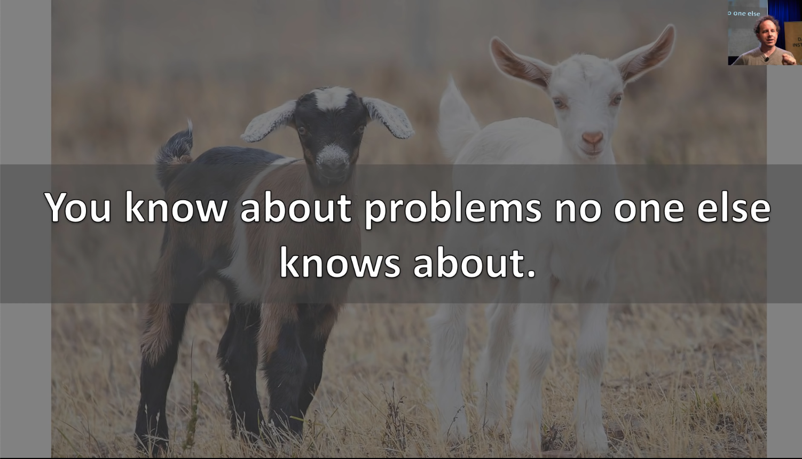
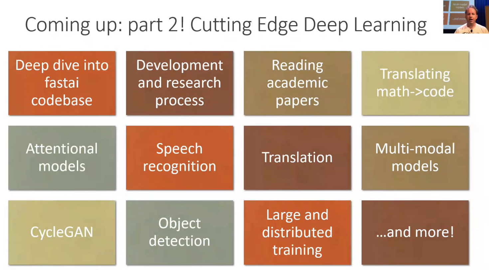

# Final notes from lesson 7 and ethics section from Lesson 6

# Lesson 6

### Ethics and Data Science [[1:49:10](https://youtu.be/U7c-nYXrKD4?t=6550)]

In the next lesson, we're going to be looking at generative models both text and image generative models. Generative models are where you can create a new piece of text or a new image or a new video or a new sound. As you probably are aware, this is the area that deep learning has developed the most in in the last 12 months. We're now at a point where we can generate realistic looking videos, images, audio, and to some extent even text. There are many things in this journey which have ethical considerations, but perhaps this area of generative modeling is one of the largest ones. So before I got into it, I wanted to specifically touch on ethics and data science.

Most of the stuff I'm showing you actually comes from Rachel, and Rachel has a really cool [TEDx San Francisco talk](https://youtu.be/LqjP7O9SxOM) that you can check out on YouTube. A more extensive analysis of ethical principles and bias principles in AI which you can find at this talk [here](https://youtu.be/WC1kPtG8Iz8), and she has a playlist that you can check out.

We've already touched on an example of bias which was this gender shades study where, for example, lighter male skin people on IBM's main computer vision system are 99.7% accurate, and darker females are some hundreds of times less accurate in terms of error (so extraordinary differences). It's, first of all, important to be aware that not only can this happen technically, but this can happen on a massive companies rolled out publicly available highly marketed system that hundreds of quality control people have studied and lots of people are using. It's out there in the wild.

They all look kind of crazy, right? So it's interesting to think about why. One of the reasons why is that the data we feed these things. We tend to use, me included, a lot of these datasets kind of unthinkingly. But like ImageNet which is the basis of like a lot of the computer vision stuff we do is over half American and Great Britain.

When it comes to the countries that actually have most of the population in the world, I can't even see them here. They're somewhere in these impossibly thin lines. Because remember, these datasets are being created almost exclusively by people in US, Great Britain, and nowadays increasingly also China. So there's a lot of bias in the content we're creating, because of a bias in the people that are creating that content even when, *in theory*, it's being created in a very kind of neutral way, but you can't argue with the data. It's obviously not neutral at all.

When you have biased data creating biased algorithms, you then need to ask "what are we doing with that?" We've been spending a lot of time talking about image recognition. A couple of years ago, this company DeepGlint advertised their image recognition system which can be used to do mass surveillance on large crowds of people, find any person passing through who is a person of interest in theory. So putting aside even the question of "is it a good idea to have such a system?" you kind of think "is it a good idea to have such a system where certain kinds of people are 300 times more likely to be misidentified?"

Then thinking about it, so this is now starting to happen in America - these systems are being rolled out. There are now systems in America that will identify a person of interest in a video and send a ping to the local police. These systems are extremely inaccurate, and extremely biased. And what happens then, of course, is if you're in a predominantly black neighborhood where the probability of successfully recognizing you is much lower, and you're much more likely to be surrounded by black people, and so suddenly all of these black people are popping up as persons of interest, or in a video of a person of interest. All the people in the video are all recognized as in the vicinity of a person of interest, you suddenly get all these pings going off the local police department causing the police to run down there. Therefore likely to lead to a larger number of arrests, which is then likely to feed back into the data being used to develop the systems.

So this is happening right now. Thankfully, a very small number of people are actually bothering to look into these things. I mean ridiculously small, but at least it's better than nothing. One of the best ways that people get publicity is to do "funny" experiments like let's try the mug shot image recognition system that's being widely used and try it against the members of Congress, and find out that there are 28 black members of Congress who would have been identified by this system (obviously incorrectly).

We see this kind of bias in a lot of the systems we use, not just image recognition but text translation when you convert "She is a doctor. He is a nurse" into Turkish, you quite correctly get a gender inspecific pronoun because that's what Turkish uses. You could then take that and feed it back into Turkish with your gender in specific pronoun, and you will now get "He is a doctor. She is a nurse." So the bias, again, this is in a massively widely rolled out, carefully studied system. It's not like even these kind of things (a little one-off things) then get fixed quickly, these issues have been identified in Google Translate for a very long time, and they're still there. They don't get fixed.

The kind of results of this are, in my opinion, quite terrifying. Because what's happening is that in many countries including America where I'm speaking from now, algorithms are increasingly being used for all kinds of public policy, judicial, and so forth purposes.

For example, there's a system called COMPAS which is very widely used to decide who's going to jail. It does that in a couple of ways; it tells judges what sentencing guidelines they should use for particular cases, and it tells them also which people (the system says) should be let out on bail. But here's the thing. White people, it keeps on saying let this person out even though they end up reoffending, and vice versa. It's systematically out by double compared to what it should be in terms of getting it wrong with white people versus black people. So this is  kind of horrifying because, amongst other things, the data that it's using in this system is literally asking people questions about things like "did any of your parents ever go to jail?" or "do any of your friends do drugs?" They're asking questions about other people who they have no control over. So not only are these systems very systematically biased, but they're also being done on the basis of data which is totally out of your control. "Are your parents divorced?" is another question that's being used to decide whether you go to jail or not.

When we raise these issues on Twitter or in talks or whatever, there's always a few people (always white men) who will always say like "that's just the way the world is." "That's just reflecting what the data shows." But when you actually look at it, it's not. It's actually systematically erroneous. And systematically erroneous against people of color, minorities - the people who are less involved in creating the systems that these products are based on.

Sometimes this can go a really long way. For example, in Myanmar there was a genocide of Rohingya people. That genocide was very heavily created by Facebook. Not because anybody at Facebook wanted it, I mean heavens no, I know a lot of people at Facebook. I have a lot of friends at Facebook. They're really trying to do the right thing. They're really trying to create a product that people like, but not in a thoughtful enough way. Because when you roll out something where literally in Myanmar - a country that maybe half of people didn't have electricity until very recently. And you say "hey, you can all have free internet as long as it's just Facebook", you must think carefully about what you're doing. Then you use algorithms to feed people the stuff they will click on. Of course what people click on is stuff which is controversial, stuff that makes their blood boil. So when they actually started asking the generals in the Myanmar army that were literally throwing babies onto bonfires, they were saying "we know that these are not humans. We know that they are animals, because we read the news. We read the internet." Because this is the stories that the algorithms are pushing. The algorithms are pushing the stories, because the algorithms are good. They know how to create eyeballs, how to get people watching, and how to get people clicking. Again, nobody at Facebook said let's cause a massive genocide in Myanmar. They said let's maximize the engagement of people in this new market on our platform.

They very successfully maximized engagement. It's important to note people warned executives of Facebook how the platform was being used to incite violence as far back as 2013, 2014, 2015. And 2015, someone even warned executives that Facebook could be used in Myanmar in the same way that the radio broadcast were used in Rwanda during the Rwandan genocide. As of 2015, Facebook only had four contractors who spoke Burmese working for them. They really did not put many resources into the issue at all, even though they were getting very very alarming warnings about it.

So why does this happen? The part of the issue is that ethics is complicated, and you will not find Rachel or I telling you how to do ethics, how do you fix this - we don't know. We can just give you things to think about. Another part of a problem we keep hearing is, it's not my problem, I'm just a researcher, I am just a techie, I'm just building a data set, I'm not part of a problem, I'm part of this foundation that's far enough away that I can imagine that I'm not part of this. But if you're creating ImageNet, and you want it to be successful, you want lots of people to use it, you want lots of people to build products on it, lots people to do research on top of it. If you're trying to create something that people are using, you want them to use, then please try to make it something that won't cause massive amounts of harm, and doesn't have massive amounts of bias.

It can actually come back and bite you in the arse. The Volkswagen engineer who ended up actually encoding the thing that made them systematically cheat on their diesel emissions tests on their pollution tests ended up in jail. Not because it was their decision to cheat on the tests, but because their manager told them to write their code, and they wrote the code. Therefore they were the ones that ended up being criminally responsible, and they were the ones that were jailed. So if you do, in some way, a crappy thing that ends up causing trouble, that can absolutely come back around and get you in trouble as well.

Sometimes it can cause huge amounts of trouble. If we go back to World War II, then this was one of the first great opportunities for IBM to show off their amazing tabulating system. And they had a huge client in Nazi Germany. And Nazi Germany used this amazing new tabulating system to encode all of the different types of Jews that they had in the country and all the different types of problem people. So Jews were 8, gypsies were 12, then different outcomes were coded; executions were 4, death in a gas chamber was 6.

A Swiss judge ruled that IBM was actively involved facilitating the commission of these crimes against humanity. There are absolutely plenty of examples of people building data processing technology that are directly causing deaths, sometimes millions of deaths. We don't want to be one of those people. You might have thought "oh you know, I'm just creating some data processing software" and somebody else is thinking "I'm just the sales person" and somebody else is thinking "I'm just the biz dev person opening new markets." But it all comes together. So we need to care.

One of the things we need to care about is getting humans back in the loop. When we pull humans out of the loop is one of the first times that trouble happens. I don't know if you remember, I remember this very clearly when I first heard that Facebook was firing the human editors that were responsible for basically curating the news that ended up on the Facebook pages. And I've gotta say, at the time, I thought that's a recipe for disaster. Because I've seen again and again that humans can be the person in the loop that can realize this isn't right. It's very hard to create an algorithm that can recognize "this isn't right." Or else, humans are very good at that. And we saw that's what happened. After Facebook fired the human editors, the nature of stories on Facebook dramatically changed. You started seeing this proliferation of conspiracy theories, and the kind of the algorithms went crazy with recommending more and more controversial topics. And of course, that changed people's consumption behavior causing them to want more and more controversial topics.

One of the really interesting places this comes in, Cathy O'Neil (who's got a great book called Weapons of Math Destruction) and many others have pointed out. What happens to algorithms is that they end up impacting people. For example, COMPAS sentencing guidelines go to a judge. Now you can say the algorithm is very good. I mean in COMPAS' case, it isn't. It actually turned out to be about as bad as random because it's a black box and all that. But even if it was very good, you could then say "well, the judge is getting the algorithm; otherwise they're just be getting a person - people also give bad advice. So what?" Humans respond differently to algorithms. It's very common, particularly for a human that is not very familiar with the technology themselves like a judge to see like "oh that's what the computer says." The computer looked it up and it figured this out.

It's extremely difficult to get a non-technical audience to look at a computer recommendation and come up with a nuanced decision-making process. So what we see is that algorithms are often put into place with no appeals process. They're often used to massively scale up decision making systems because they're cheap. Then the people that are using those algorithms tend to give them more credence than they deserve because very often they're being used by people that don't have the technical competence to judge them themselves.

A great example was here's an example of somebody who lost their health care. They lost their health care because of an error in a new algorithm that was systematically failing to recognize that there are many people that need help with cerebral palsy and diabetes. So this system which had this error that was later discovered was cutting off these people from the home care that they needed. So that cerebral palsy victims no longer had the care they needed. So their life was destroyed basically.

When the person that created that algorithm with the error was asked about this and more specifically said should they have found a better way to communicate the system, the strengths, the failures, and so forth, he said "yeah, I should probably also dust under my bed." That was the level of interest they had.

This is extremely common. I hear this all the time. And it's much easier to see it from afar and say "okay, after the problems happened I can see that that's a really shitty thing to say." But it can be very difficult when you're kind of in the middle of it.

[Rachel] I just want to say one more thing about that example. This was a case where it was separate; there was someone who created the algorithm, then I think different people implemented the software, and this is now in use in over half of the 50 states, then there was also the particular policy decisions made by that state. So this is one of those situations where nobody felt responsible because the algorithm creators are like "oh no, it's the policy decisions of the state that were bad." And the state can be like "oh no, it's the ones who implemented the software" and so everyone's just kind of pointing fingers and not taking responsibility.

And you know, in some ways maybe it's unfair, but I would argue the person who is creating the data set and the person who is implementing the algorithm is the person best placed to get out there and say "hey here are the things you need to be careful of" and make sure that they are part of the implementation process.

We've also seen this with YouTube. It's similar to what happened with Facebook and we've heard examples of students watching the fast.ai courses who say "hey Jeremy and Rachel, watching the fast.ai courses, really enjoyed them and at the end of one of them the YouTube autoplay fed me across to a conspiracy theory." What happens is that once the system decides that you like the conspiracy theories, it's going to just feed you more and more.

[Rachel] Just briefly. You don't even have to like conspiracy theories. The goal is to get as many people hooked on conspiracy theories as possible is what the algorithms trying to do whether or not you've expressed interest.

The interesting thing again is I know plenty of people involved in YouTube's recommendation systems. None of them are wanting to promote conspiracy theories. But people click on them, and people share them, and what tends to happen is also people that are into conspiracy theories consume a lot more YouTube media. So it actually is very good at finding a market that watches a lot of hours of YouTube and then it makes that market watch even more.

So this is an example of a feedback loop. The New York Times is now describing YouTube as perhaps the most powerful radicalizing instrument of the 21st century. I can tell you my friends that worked on the YouTube recommendation system did not think they were creating the most powerful radicalizing instrument of the 21st century. And to be honest, most of them today when I talk to them still think they're not. They think it's all bull crap. Not all of them, but a lot of them now are at the point where they just feel like they're the victims here, people are unfairly ... you know, they don't get it, they don't understand what we're trying to do. It's very very difficult when you are right out there in the heart of it.

So you've got to be thinking from right at the start. What are the possible unintended consequences of what you're working on? And as the technical people involved, how can you get out in front and make sure that people are aware of them.

[Rachel] I just also need to say that in particular, many of these conspiracy theories are promoting white supremacy, they're kind of far-right ethno-nationalism, anti-science, and i think maybe five or ten years ago, I would have thought conspiracy theories are more fringe thing, but we're seeing huge societal impact it can have for many people to believe these.

And you know, partly it's you see them on YouTube all the time, it starts to feel a lot more normal. So one of the things that people are doing to try to say how to fix this problem is to explicitly get involved in talking to the people who might or will be impacted by the kind of decision making processes that you're enabling.

For example, there was a really cool thing recently where literally statisticians and data scientists got together with people who had been inside the criminal system (i.e. had gone through the bail and sentencing process of criminals themselves) and talking to the lawyers who worked with them, and put them together with the data scientists, and actually put together a timeline of how exactly does it work, and where exactly the other places that there are inputs, and how do people respond to them, and who's involved.

This is really cool. This is the only way for you as a data product developer to actually know how your data product is going to be working.

A really great example of somebody who did a great job here was Evan Estola at Meetup who said "hey, a lot of men are going to our tech meetups and if we use a recommendation system naively, it's going to recommend more tech meetups to man, which is going to cause more men to go to them, and then when women do try to go, they'll be like "oh my god, there's so many men here" which is going to cause more men to go to the tech meetups. So showing recommendations to men, and therefore not showing them to women.

What Evan and meetup decided was to make an explicit product decision that this would not even be representing the actual true preferences of people. It would be creating a runaway feedback loop. So let's explicitly stop it before it happens, and not recommend less tech meetups women and more tech meetups to men. So I think it's really cool. It's like it's saying, we don't have to be slaves to the algorithm. We actually get to decide.

Another thing that people can do to help is regulation. Normally, when we talk about regulation, there's a natural reaction of like "how do you regulate these things? That's ridiculous - you can't regulate AI." But actually when you look at it, again and again, and this fantastic paper called [Datasheets for Datasets](https://arxiv.org/abs/1803.09010) has lots of examples of this. There are many many examples of industries where people thought they couldn't be regulated, people thought that's just how it was. Like cars. People died in cars all the time because they literally had sharp metal knobs on dashboards, steering columns weren't collapsible, and all of the discussion in the community was "that's just how cars are" and when people died in cars, it's because of the people. But then eventually the regulations did come in. And today, driving is dramatically safer - dozens and dozens of times safer than it was before. So often there are things we can do through policy.

To summarize, we are part of the0.3 to 0.5% of the world that knows how to code. We have a skill that very few other people do. Not only that, we now know how to code deep learning algorithms which is like the most powerful kind of code I know. So I'm hoping that we can explicitly think about at least not making the world worse, and perhaps explicitly making it better.

So why is this interesting to you as an audience in particular? That's because fast.ai in particular is trying to make it easy for domain experts to use deep learning. This picture of the goats here is an example of one of our international fellows from a previous course who is a goat dairy farmer and told us that they were going to use deep learning on their remote Canadian island to help study udder disease in goats. To me, this is a great example of a domain experts problem which nobody else even knows about, let alone know that it's a computer vision problem that can be solved with deep learning. So in your field, whatever it is, you probably know a lot more now about the opportunities in your field to make it a hell of a lot better than it was before. You're probably able to come up with all kinds of cool product ideas, maybe build a startup or create a new product group in your company or whatever. But also, please be thinking about what that's going to mean in practice, and think about where can you put humans in the loop? Where can you put those pressure release valves? Who are the people you can talk to who could be impacted who could help you understand? And get the humanities folks involved to understand history and psychology and sociology and so forth.

That's our plea to you. If you've got this far, you're definitely at a point now where you're ready to make a serious impact on the world, so I hope we can make sure that that's a positive impact. See you next week!

# Lesson 7

## What now? [[1:58:59](https://youtu.be/nWpdkZE2_cc?t=7139)]

That's it. That's deep learning, or at least the practical pieces from my point of view. Having watched this one time, you won't get it all. And I don't recommend that you do watch this so slowly that you get it all the first time, but you go back and look at it again, take your time, and there'll be bits that you go like "oh, now I see what he's saying" and then you'll be able to implement things you couldn't before or you'll be able to dig in more than before. So definitely go back and do it again. And as you do, write code, not just for yourself but put it on github. It doesn't matter if you think it's great code or not. The fact that you're writing code and sharing it is impressive and the feedback you'll get if you tell people on the forum "hey, I wrote this code. It's not great but it's my first effort. Anything you see jump out at you?" People will say like "oh, that bit was done well. But you know, for this bit, you could have used this library and saved you sometime." You'll learn a lot by interacting with your peers.

As you've noticed, I've started introducing more and more papers. Part 2 will be a lot of papers, so it's a good time to start reading some of the papers that have been introduced in this section. All the bits that say like derivation and theorems and lemmas, you can skip them. I do. They add almost nothing to your understanding of your practical deep learning. But the bits that say why are we solving this problem, and what are the results, and so forth, are really interesting. Then try and write English prose. Not English prose that you want to be read by Geoffrey Hinton and Yann LeCun, but English prose you want to be read by you as of six months ago. Because there's a lot more people in the audience of you as of six months ago than there is of Geoffrey Hinton and Yann LeCun. That's the person you best understand. You know what they need.

Go and get help, and help others. Tell us about your success stories. But perhaps the most important one is get together with others. People's learning works much better if you've got that social experience. So start a book club, get involved in meetups, create study groups, and build things. Again, it doesn't have to be amazing. Just build something that you think the world would be a little bit better if that existed. Or you think it would be kind of slightly delightful to your two-year-old to see that thing. Or you just want to show it to your brother the next time they come around to see what you're doing, whatever. Just finish something. Finish something and then try make it a bit better.

For example something I just saw this afternoon is the Elon Musk tweet generator. Looking at lots of older tweets, creating a language model from Elon Musk, and then creating new tweets such as "Humanity will also have an option to publish on its own journey as an alien civilization. it will always like all human being." "Mars is no longer possible," "AI will definitely be the central intelligence agency."

So this is great. I love this. And I love that Dave Smith wrote and said "these are my first-ever commits. Thanks for teaching a finance guy how to build an app in eight weeks". I think this is awesome and I think clearly a lot of care and passion is being put into this project. Will it systematically change the future direction of society as a whole? Maybe not. But maybe Elon will look at this and think "oh, maybe I need to rethink my method of prose," I don't know. I think it's great. So yeah, create something, put it out there, put a bit of yourself into it.

Or get involved in the fast.ai. The fast.ai project, there's a lot going on. You can help with documentation and tests which might sound boring but you'd be surprised how incredibly not boring it is to take a piece of code that hasn't been properly documented, and research it, and understand it, and ask Sylvain and I on the forum; what's going on? Why did you write it this way? We'll send you off to the papers that we were implementing. Writing a test requires deeply understanding that part of the machine learning world to really understand how it's meant to work. So that's always interesting.

Stats Bakman has created this nice [Dev Projects Index](https://forums.fast.ai/t/dev-projects-index/29849) which you can go onto the forum in the fast.ai dev projects section and find like here's some stuff going on that you might want to get involved in. Maybe there's stuff you want to exist you can add your own.

Create a study group you know Deena's already created a study group for San Francisco starting in January. This is how easy it is to create a study group. Go on the forum, find your little timezone subcategory, and add a post saying let's create a study group. But make sure you give people like a Google sheet to sign up, some way to actually do something.

A great example is Pierre who's been doing a fantastic job in Brazil of running study groups for the last couple of parts of the course. And he keeps posting these pictures of people having a good time and learning deep learning together, creating wiki's together, creating projects together - great experience.

Then come back for part 2 where we'll be looking at all of this interesting stuff. In particular, going deep into the fast.ai code base to understand how did we build it exactly. We will actually go through. As we were building it, we created notebooks of here's where we were at each stage, so we're actually going to see the software development process itself. We'll talk about the process of doing research; how to read academic papers, how to turn math into code. Then a whole bunch of additional types of models that we haven't seen yet. So it'll be kind of like going beyond practical deep learning into actually cutting-edge research.

### Ask Jeremy Anything [[2:05:26](https://youtu.be/nWpdkZE2_cc?t=7526)]

We had an AMA going on online and so we're going to have time for a couple of the highest ranked AMA questions from the community

**Question**: The first one is by Jeremy's request, although it's not the highest ranked. What's your typical day like? How do you manage your time across so many things that you do?

I hear that all the time, so I thought I should answer it, and I think it got a few votes. People who come to our study group are always shocked at how disorganized and incompetent I am, and so I often hear people saying like "oh wow, I thought you were like this deep learning role model and I'd get to see how to be like you and now I'm not sure I want to be like you at all." For me, it's all about just having a good time with it. I never really have many plans. I just try to finish what I start. If you're not having fun with it, it's really really hard to continue because there's a lot of frustration in deep learning. Because it's not like writing a web app where it's like authentication, check, backend service watchdog, check, user credentials, check - you're making progress. Where else, for stuff like this GAN stuff that we've been doing the last couple of weeks, it's just like; it's not working, it's not working, it's not working, no it also didn't work, and it also didn't work, until like "OH MY GOD IT'S AMAZING. It's a cat." That's kind of what it is. So you don't get that regular feedback. So yeah, you gotta have fun with it. The other thing, I don't do any meetings. I don't do phone calls. I don't do coffees. I don't watch TV. I don't play computer games. I spend a lot of time with my family. A lot of time exercising, and a lot time reading, and coding, and doing things I like. So the main thing is just finish something. Like properly finish it. So when you get to that point where you think 80% of the way through, but you haven't quite created a README yet, and the install process is still a bit clunky - this is what 99% of github projects look like. You'll see the README says "TODO: complete baseline experiments document blah blah blah." Don't be that person. Just do something properly and finish it and maybe get some other people around you to work with you so that you're all doing it together and get it done.

**Question**: What are the up-and-coming deep learning/machine learning things that you're most excited about? Also you've mentioned last year that you are not a believer in reinforcement learning. Do you still feel the same way?

I still feel exactly the same way as I did three years ago when we started this which is it's all about transfer learning. It's under-appreciated, it's under-researched. Every time we put transfer learning into anything, we make it much better. Our academic paper on transfer learning for NLP has helped be one piece of changing the direction of NLP this year, made it all the way to the New York Times - just a stupid, obvious little thing that we threw together. So I remain excited about that. I remain unexcited about reinforcement learning for most things. I don't see it used by normal people for normal things for nearly anything. It's an incredibly inefficient way to solve problems which are often solved more simply and more quickly in other ways. It probably has (maybe?) a role in the world but a limited one and not in most people's day-to-day work.

**Question**: For someone planning to take part 2 in 2019, what would you recommend doing learning practicing until the part 2 of course starts?

Just code. Yeah, just code all the time. I know it's perfectly possible, I hear from people who get to this point of the course and they haven't actually written any code yet. And if that's you, it's okay. You just go through and do it again, and this time do code. And look at the shapes of your inputs, look at your outputs, make sure you know how to grab a mini batch, look at its mean and standard deviation, and plot it. There's so much material that we've covered. If you can get to a point where you can rebuild those notebooks from scratch without too much cheating, when I say from scratch, I mean using the fast.ai library, not from scratch from scratch, you'll be in the top echelon of practitioners because you'll be able to do all of these things yourself and that's really really rare. And that'll put you in a great position to part 2.

**Question**: Where do you see the fast.ai library going in the future, say in five years?

Well, like I said, I don't make plans I just piss around so... Our only plan for fast.ai as an organization is to make deep learning accessible as a tool for normal people to use for normal stuff. So as long as we need to code, we failed at that because 99.8% of the world can't code. So the main goal would be to get to a point where it's not a library but it's a piece of software that doesn't require code. It certainly shouldn't require a goddamn lengthy hard working course like this one. So I want to get rid of the course, I want to get rid of the code, I want to make it so you can just do useful stuff quickly and easily. So that's maybe five years? Yeah, maybe longer.

All right. I hope to see you all back here for part 2. Thank you.
